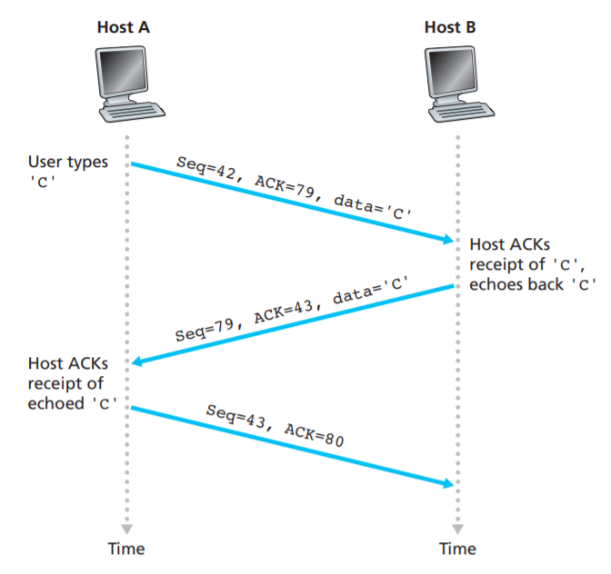

### Delayed ACK and Nagle Algorithm
<pre>Date: 2019-11-14 21:26:00            Tag: Networking</pre>

TCP supports **interactive data flow** and we can use APPs like telnet and ssh to access remote host.
如果只输入一个字符就传输信息会造成资源浪费，传输一个字母要花费64 * 3 = 192 bytes（Ethernet has a minimum frame length of 64 bytes, including IP header, Ethernet header, and trailer）: 

To make this more efficient, TCP use Delayed Acknowledgement and Nagle Algorithm.

#### Delayed Acknowledgement

TCP uses a delayed acknowledgement timer that goes off every K ms to send ACK.
- If there is new data to send during this period, the ACK can be piggybacked(捎带发送) with the data segment. 
- Otherwise, an ACK segment(with no data payload） is sent till K ms

#### Nagle Algorithm

- TCP sends one byte and buffers all subsequent bytes until an acknowledgment for the first byte is received.  
- All buffered bytes are sent in a single segment